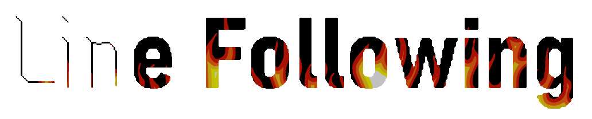
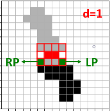
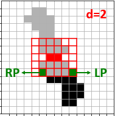
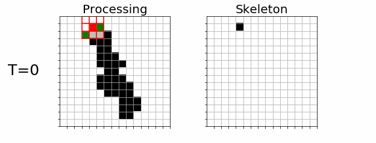
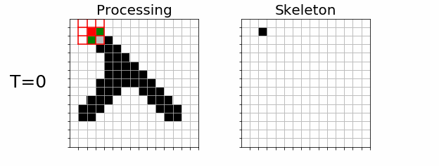
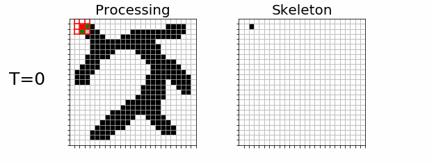

# Line Thinning by Line Following

This repository contains an **unofficial python implementation** of the *Line Thinning by Line Following (LF)* described in "Pattern Recogniion Letters" by Orit Baruch (1988).

<!-- 
[IMG: 放一個"Line Follwing書寫體"圖檔，有左至右慢慢被thinning到"o"字元]()
-->


## Original Paper

**Line Thinning by Line Following** [[PDF](https://www.researchgate.net/publication/230674157_Line_thinning_by_line_following)]
How would we, humans, perform line thinning? The most natural way is by following the line with our eyes, and marking the approximate center between the line edges. Sesing the global picture enables us to ignore noise and identify easily line ends. Why not make the computer do the same thing?

<!--
## ~~Features~~

~~* Successive remove versus lin following~~
~~* For human beings, the most natural way is by following the line with eye, and marking the approximate center between the line edges.~~
-->

## How does it work

* The line-follower is called to follow each encountered line.
<!-- 
[IMG: 多物件圖中，左上右下掃描，掃描到的物件整個變紅，然後結束&Repeat]()
-->
* While following, the line follower erases the line in the input image and creates the skeleton in the target image.
<!--
[IMG: 延續上圖，對掃描物件進行處理(show框，不show pointers)，target圖同步生成骨架]()
-->
* The line following is based on two pointers and a dynamic window:
    <table>
      <tbody>
        <tr>
          <td>LP</td>
          <td>A pointer to follow the left edge of a line</td>
        </tr>
        <tr>
          <td>RP</td>
          <td>A pointer to follow the right edge of a line</td>
        </tr>
        <tr>
          <td>W</td>
          <td>A rectangular window whose sides are parallel to the sides of the matrix</td>
        </tr>
        <tr>
          <td>d</td>
          <td>The distance of a point to a line is measured as usual by the length (in pixels) of the normal from the point to that line</td>
        </tr>
      </tbody>
    </table>

    <div align="center">
    <div style="width: 60%; margin:0 left;text-align: left;">
      
      
    </div>
    </div>
<!--
[IMG: 靜態單支圖，show W/LP/RP, d=1,2,3]()
-->


* When the follow identifies branching of the line, it calls itself recursively to follow each of the branches.
<!--
[IMG: 靜態分支圖，show W/LLP/LRP/RLP/RRP]()
-->
### The process illustrated:

|||
|-:|:-:|
|single-branch<br>(d=1)||
|two-branch<br>(d=1)||
|multi-branch<br>(d=1)||


<!--
## Results

|Original|Result|
|-|-|
|||
|||

## Comparative Implementation Results
||reference figure| image size| processing time|
|-|-:|-:|-:|
|SR|ddd|100 * 100| 1 sec|
|LR|ddd|100 * 100| 1 sec|
-->
## Usage
```
$ python thin.py --input ./data/no-branch.jpg -out output.jpg
```


## License
This project is under the [MIT License](./LICENSE). See the LICENSE file for the full license text.